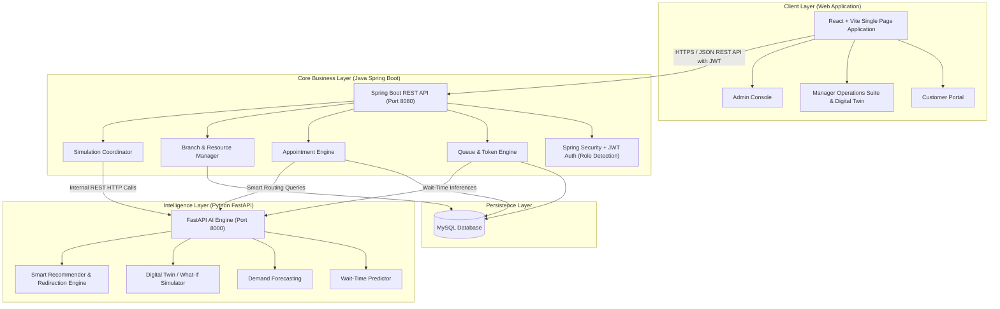

# AVENUE - System Architecture & Engineering Blueprint

**AVENUE** is an AI-powered banking branch operations and customer experience optimization platform.

---

## 1. High-Level Architecture Overview

AVENUE is designed as a **3-tier modular system with an independent AI microservice**:



---

## 2. Beginner-Friendly Explanation of Components

### A. The Frontend (`avenue-frontend`)
* **What it is:** The visual website running in the user's browser (Chrome, Edge, etc.).
* **Tech:** React + Vite.
* **Why React + Vite?** Vite provides lightning-fast startup and rebuild times. React lets us build responsive, reusable UI cards, dashboards, and live status monitors.
* **What it does:**
  - **Customer:** Searches branches, books appointments, tracks live queue tokens, receives smart redirection advice if another nearby branch has 0 waiting time.
  - **Manager:** Real-time branch cockpit (queue load, staff utilization, bottleneck alerts, what-if digital twin simulator to test staff scheduling).
  - **Admin:** Management of branches, services, staff, and one-click demo data generation for hackathon demos.

### B. The Core Backend (`avenue-backend`)
* **What it is:** The brain that enforces banking business rules, data validation, and security.
* **Tech:** Java 17+ with Spring Boot 3.
* **Why Spring Boot?** It is enterprise-grade, strongly typed, rock-solid for transaction processing, role-based authorization, and is the industry gold standard for banking.
* **What it does:**
  - Manages secure login and issues **JWT tokens**.
  - Automatically identifies role (`CUSTOMER`, `MANAGER`, `ADMIN`) based on user email or credentials.
  - Manages live token queues (e.g., Token `A-102` for Cash Deposit, Counter 3).
  - Acts as the orchestrator: when wait-time prediction or branch simulation is requested, it delegates computation to the Python AI service.

### C. The AI/ML Microservice (`avenue-ai`)
* **What it is:** A specialized Python service exposing mathematical and machine learning predictions.
* **Tech:** Python 3.10+, FastAPI, scikit-learn, pandas, numpy.
* **Why separate Python?** Python has the richest ecosystem for machine learning, statistical modeling, and queue simulation algorithms. FastAPI makes it accessible via ultra-fast REST endpoints.
* **What it does:**
  - **Wait-Time Prediction:** Predicts real-time wait times given service type, current counter staff, and queue depth.
  - **Demand Forecasting:** Predicts footfall surges by time of day and day of week.
  - **Digital Twin / What-if Simulator:** Simulates: *"What happens if we reassign 2 staff members from Inquiries to Cashier counters between 2:00 PM and 4:00 PM?"* and calculates throughput and customer wait-time reduction.

### D. The Database (`MySQL`)
* **What it is:** The relational storage where all persistent data lives.
* **Why MySQL?** Relational tables ensure ACID integrity for appointments, tokens, staff rosters, and audit logs.

---

## 3. Recommended Project Folder Structure

```text
TCS-Hackthon/
│
├── avenue-frontend/             # React + Vite Client Application
│   ├── public/                  # Static assets (logos, icons)
│   ├── src/
│   │   ├── api/                 # Axios/Fetch API client functions
│   │   ├── assets/              # UI images and stylesheets
│   │   ├── components/          # Reusable UI widgets (Navbar, StatCards, Modals, Badges)
│   │   │   ├── common/
│   │   │   ├── customer/
│   │   │   ├── manager/
│   │   │   └── admin/
│   │   ├── context/             # AuthContext (JWT, user role state)
│   │   ├── pages/               # Top-level view routes
│   │   │   ├── auth/            # Login, Role Detection
│   │   │   ├── customer/        # Customer Dashboard, Booking, Queue Tracker
│   │   │   ├── manager/         # Cockpit, Digital Twin, Analytics, Roster
│   │   │   └── admin/           # Management consoles & Demo data loader
│   │   ├── App.jsx              # Main App router
│   │   └── main.jsx             # Entry point
│   ├── package.json
│   └── vite.config.js
│
├── avenue-backend/              # Spring Boot Java Application
│   ├── src/main/java/com/avenue/
│   │   ├── AvenueApplication.java
│   │   ├── config/              # SecurityConfig, CorsConfig, JwtFilter
│   │   ├── controller/          # REST Endpoints (Auth, Customer, Manager, Admin)
│   │   ├── dto/                 # Request & Response payload structures
│   │   ├── entity/              # JPA Database Entities (User, Branch, Appointment, Token, Staff)
│   │   ├── repository/          # Spring Data JPA Repositories
│   │   └── service/             # Business Logic & AI Microservice client
│   ├── src/main/resources/
│   │   ├── application.properties
│   │   └── schema-init.sql
│   └── pom.xml
│
├── avenue-ai/                   # Python FastAPI Machine Learning Service
│   ├── models/                  # Trained scikit-learn models / estimators
│   ├── app/
│   │   ├── main.py              # FastAPI application entry point
│   │   ├── routers/             # Endpoints (predict, forecast, simulate, recommend)
│   │   ├── services/            # Simulation and ML inference logic
│   │   └── schemas/             # Pydantic request/response data contracts
│   ├── data/                    # Synthetic / historical branch datasets
│   └── requirements.txt
│
├── database/                    # Database initialization scripts
│   ├── 01_schema.sql            # Tables, constraints, and indexes
│   └── 02_seed_demo_data.sql    # Rich realistic hackathon demo data
│
├── docs/                        # Specifications, Architecture, & Demo Scripts
│   └── API_CONTRACTS.md         # Data format agreed between Frontend, Java, and Python
│
├── ARCHITECTURE.md              # High-level architecture (this file)
└── README.md                    # Project README and quick start
```

---

## 4. How the Three Roles Interact (Data Flow)

1. **Login & Role Detection:**
   - User types an email (e.g. `alex@customer.com`, `sarah@avenuebank.com`, or `admin@avenuebank.com`).
   - The backend checks credentials and issues a JWT token with roles `ROLE_CUSTOMER`, `ROLE_MANAGER`, or `ROLE_ADMIN`.
   - The frontend automatically routes the user to the appropriate portal.

2. **Customer Experience Flow:**
   - Customer wants to visit Downtown Branch.
   - Frontend asks Spring Boot for branch status.
   - Spring Boot requests Python AI: *"Given 14 people currently waiting for Cashier, what is the expected wait time?"*
   - Python AI returns `42 mins` and notices Uptown Branch 1.2 miles away has `4 mins` wait time.
   - Customer UI displays: *"Expected wait: 42 mins. Tip: Uptown Branch is 5 mins away with only 4 mins wait. Book there instead?"*

3. **Manager Operations & Digital Twin Flow:**
   - Branch manager sees live queue bottleneck (e.g., Loan Inquiries backed up).
   - Manager opens **Digital Twin Simulator**:
     - Tests adjusting counter assignments (e.g., adding 1 staff to Loans).
     - Python simulation engine runs a discrete-event queue model and returns: *"Reduces average wait by 64%, clears backlog in 35 minutes"*.
   - Manager clicks **"Apply Recommendation"** to update live branch counter configuration in real-time.
